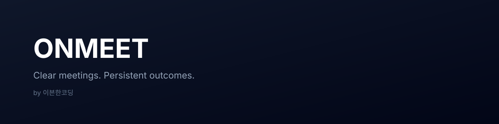

  

<h1 align="center">ONMEET</h1>

  <strong>회의의 휘발성을 없애는 B2B 협업 플랫폼</strong> 
  Make meetings clear, persistent, and actionable.

---

## 🚀 About ONMEET

**ONMEET**은  
회의가 끝난 순간 사라져버리는 정보들을 구조화하여  
**기록 · 공유 · 알림**까지 이어주는 B2B 회의 협업 플랫폼입니다.

- 조직(회사) 기반 사용자 관리
- 초대 중심의 보안 친화적 온보딩
- 회의 일정 및 참여자 관리
- 회의 시작 전 알림 (ex. 10분 전 알림)
- 회의 이후 기록과 맥락을 남기는 흐름

> 우리는 “회의를 했다”가 아니라  
> **“회의 이후 무엇이 남았는가”에 집중합니다.**

---

## 🧩 Key Concepts

- **Organization-first**  
  개인이 아닌 *조직 단위*로 설계된 서비스

- **Invite-based Access**  
  초대 링크 기반의 안전한 사용자 등록

- **Event-driven Notification**  
  회의 시간 기준 자동 알림 시스템

- **Minimal & Clear UX**  
  복잡함을 숨기고, 필요한 정보만 남깁니다

---

## 👥 Team — 이븐한코딩

| 이름 | 역할 | Git |
|----|----|----|
| 최승은 | Team Lead / Devops | `@xeunnie` |
| 양진영 | AI | rkddl94@gmail.com |
| 박영진 | Auth / Security | ##@gmail.com |
| 조예성 | Notification | xocds991215@gmail.com |

---

## 🛠 Tech Stack

- **Frontend**: React · TypeScript  
- **Backend**: Springboot
- **Auth / Flow**: Organization-based Access Control  
- **Notification**: Scheduled Event Trigger

---

  Built with clarity, by 이븐한코딩

